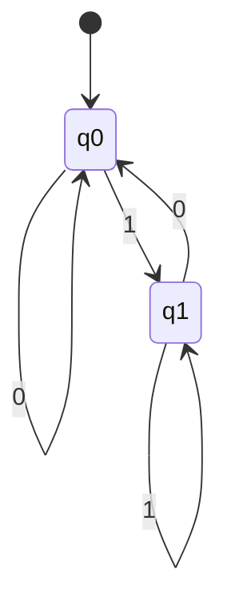
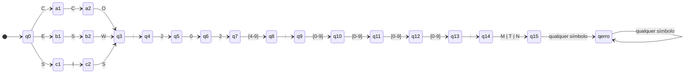

# Aula 05 — Expressões Regulares

## Material do estudante — versão sem gabarito

**Disciplina:** Linguagens Formais e Autômatos  
**Curso:** Engenharia de Software  
**Profª:** Kadidja Valéria  
**Aluno(a):** Luis Fernando Vieira Borges   
**Data de entrega:** 13/09/2026
**Duração sugerida:** 1h30  
**Modalidade:** aula teórico-prática  
**Atividade avaliativa:** reconhecimento e construção de padrões — **0,5 ponto**

---

## Competência da aula

Aplicar expressões regulares para descrever e reconhecer linguagens regulares, justificando a relação entre a especificação da linguagem, a expressão construída e um autômato finito equivalente.

## Objetivos de aprendizagem

Ao final da aula, o estudante deverá ser capaz de:

- compreender o conceito de expressão regular;
- identificar e aplicar seus principais operadores;
- interpretar uma expressão e explicar a linguagem que ela denota;
- construir expressões regulares a partir de uma especificação;
- elaborar casos de teste positivos e negativos;
- distinguir a notação clássica das extensões de motores Regex;
- relacionar expressões regulares, linguagens regulares, DFA e NFA.

## Roteiro sugerido

| Etapa | Tempo | Estratégia |
|---|---:|---|
| Situação-problema e revisão | 15 min | Perguntas e exemplos no quadro |
| Conceito e operadores | 25 min | Exposição dialogada |
| Exemplos resolvidos | 20 min | Construção passo a passo |
| Regex, DFA e NFA | 10 min | Modelagem de estados |
| Exercício guiado | 10 min | Trabalho em duplas |
| Desafio no Regex Learn | 10 min | Teste, correção e justificativa |

---

# 1. Introdução

> **Como podemos descrever, de maneira compacta, todas as cadeias que seguem determinado padrão?**

Considere um sistema que precisa aceitar códigos como `LFA-2026-001` e rejeitar entradas como `LFA26-1`. Seria inviável enumerar todos os códigos possíveis. Precisamos de uma regra finita capaz de representar um conjunto possivelmente infinito de palavras.

Uma **expressão regular** é uma notação para descrever padrões em cadeias. Na prática, pode localizar, extrair ou validar textos. Na teoria de Linguagens Formais, ela denota uma **linguagem regular**.

O ponto de partida não é “qual símbolo Regex devo usar?”, mas:

1. Qual é o alfabeto?
2. Quais propriedades uma palavra válida deve possuir?
3. Quais palavras devem ser aceitas e rejeitadas?
4. A propriedade pode ser reconhecida usando apenas memória finita?

---

# 2. Revisão de conceitos

Considere o alfabeto:

$$
\Sigma=\{0,1\}.
$$

## 2.1 Alfabeto

Um **alfabeto** é um conjunto finito e não vazio de símbolos. Exemplos:

- $\Sigma=\{0,1\}$;
- $\Sigma=\{a,b\}$;
- algarismos decimais: $\Sigma=\{0,1,\ldots,9\}$.

## 2.2 Cadeia ou palavra

Uma **palavra** sobre $\Sigma$ é uma sequência finita de símbolos do alfabeto. Sobre $\{0,1\}$, `0`, `101` e `0011` são palavras. Seu comprimento é indicado por $|w|$; por exemplo, $|101|=3$.

## 2.3 Cadeia vazia

A cadeia sem símbolos é representada por $\varepsilon$ e possui comprimento zero:

$$
|\varepsilon|=0.
$$

Não confunda $\varepsilon$ com o conjunto vazio $\varnothing$: o primeiro é uma palavra; o segundo é um conjunto sem elementos.

## 2.4 Linguagem

Uma **linguagem** sobre $\Sigma$ é qualquer subconjunto de $\Sigma^*$. Exemplo:

$$
L=\{w\in\{0,1\}^*\mid w\text{ termina em }1\}.
$$

Logo, `1`, `01` e `1101` pertencem a $L$; $\varepsilon$, `0` e `110` não pertencem.

## 2.5 Operações sobre linguagens

Se $L_1=\{a,b\}$ e $L_2=\{0,1\}$:

- **união:** $L_1\cup L_2=\{a,b,0,1\}$;
- **concatenação:** $L_1L_2=\{a0,a1,b0,b1\}$;
- **potência:** $L^0=\{\varepsilon\}$ e $L^{n+1}=L^nL$;
- **fechamento de Kleene:** $L^*=\bigcup_{n\geq0}L^n$, incluindo $\varepsilon$;
- **fechamento positivo:** $L^+=\bigcup_{n\geq1}L^n=LL^*$, sem $\varepsilon$, salvo se ela já pertencer a $L$.

Para $L=\{a\}$:

$$
L^*=\{\varepsilon,a,aa,aaa,\ldots\},\qquad
L^+=\{a,aa,aaa,\ldots\}.
$$

---

# 3. O que são expressões regulares?

## 3.1 Ideia intuitiva

Uma expressão regular funciona como uma “fórmula” que combina símbolos e operadores para representar uma linguagem. Ela não é uma palavra da linguagem: é uma descrição do conjunto de palavras.

## 3.2 Definição formal clássica

Sobre um alfabeto $\Sigma$:

1. $\varnothing$, $\varepsilon$ e cada símbolo $a\in\Sigma$ são expressões regulares;
2. se $r$ e $s$ são expressões regulares, então $(r|s)$, $(rs)$ e $(r^*)$ também são;
3. nada além do que pode ser obtido pelas regras anteriores é uma expressão regular clássica.

A função $L(r)$ associa a expressão $r$ à linguagem que ela representa:

$$
\begin{aligned}
L(\varnothing)&=\varnothing, & L(\varepsilon)&=\{\varepsilon\}, & L(a)&=\{a\};\\
L(r|s)&=L(r)\cup L(s), & L(rs)&=L(r)L(s), & L(r^*)&=L(r)^*.
\end{aligned}
$$

## 3.3 Primeiros exemplos

| Expressão | Linguagem representada | Aceitas | Rejeitadas |
|---|---|---|---|
| `a` | $\{a\}$ | `a` | $\varepsilon$, `aa`, `b` |
| `a*` | $\{\varepsilon,a,aa,aaa,\ldots\}$ | $\varepsilon$, `a`, `aaa` | `b`, `ab` |
| `a+` | uma ou mais ocorrências de `a` | `a`, `aa` | $\varepsilon$, `b` |
| `a\|b` | $\{a,b\}$ | `a`, `b` | `ab`, $\varepsilon$ |
| `(ab)*` | $\{\varepsilon,ab,abab,\ldots\}$ | $\varepsilon$, `ab`, `abab` | `a`, `abb`, `ba` |

**Observação:** `a+` é abreviação de `aa*`; não é necessário como operador primitivo na teoria clássica.

---

# 4. Principais operadores

## 4.1 Concatenação

Escrever expressões lado a lado indica sequência. `ab` exige `a` seguido de `b`.

$$
L(ab)=\{ab\}.
$$

Em `(0|1)1`, o primeiro símbolo pode ser `0` ou `1`, e o segundo deve ser `1`: $\{01,11\}$.

## 4.2 União ou alternância `|`

`a|b` significa “`a` ou `b`”. A alternância une linguagens:

$$
L(a|b)=L(a)\cup L(b).
$$

## 4.3 Fechamento de Kleene `*`

`r*` representa **zero ou mais** concatenações de palavras de $L(r)$. Portanto, sempre admite $\varepsilon$.

Exemplo: `(01)*` aceita $\varepsilon$, `01`, `0101`, ...

## 4.4 Operador `+`

`r+` representa **uma ou mais** ocorrências. É derivável:

$$
r^+=rr^*.
$$

Exemplo: `[0-9]+` aceita `7` e `2026`, mas não a cadeia vazia.

## 4.5 Operador `?`

`r?` representa **zero ou uma** ocorrência:

$$
r?\equiv(r|\varepsilon).
$$

Exemplo: `-?[0-9]+` permite um sinal de menos opcional.

## 4.6 Agrupamento `()`

Os parênteses controlam o alcance dos operadores. Compare:

- `ab*`: `a` seguido de zero ou mais `b`;
- `(ab)*`: zero ou mais blocos `ab`.

## 4.7 Classes `[]` e intervalos

Uma classe escolhe **um** caractere do conjunto:

- `[abc]` equivale, no caso simples, a `(a|b|c)`;
- `[a-z]` indica uma letra minúscula no intervalo;
- `[0-9]` indica um algarismo;
- `[A-Za-z0-9]` indica uma letra ou algarismo.

`[01]*` descreve todas as palavras binárias, inclusive $\varepsilon$.

## 4.8 Quantificadores

| Recurso | Significado | Exemplo |
|---|---|---|
| `{n}` | exatamente $n$ ocorrências | `[0-9]{3}` |
| `{n,m}` | entre $n$ e $m$ | `[A-Z]{2,4}` |
| `{n,}` | no mínimo $n$ | `a{2,}` |

Esses quantificadores são abreviações práticas de repetições finitas e estrela; não aumentam o poder expressivo regular.

## 4.9 Âncoras `^` e `$`

- `^` exige o início da entrada;
- `$` exige o fim da entrada.

Para **validar a palavra inteira**, use as duas: `^[01]+$`. Sem âncoras, um motor pode encontrar apenas um trecho válido dentro de uma entrada inválida.

As âncoras expressam posição no texto e pertencem à sintaxe dos motores, não aos operadores fundamentais da definição clássica.

## 4.10 Caractere `.`

Em muitos motores, `.` corresponde a quase qualquer caractere, geralmente exceto quebra de linha. Para reconhecer um ponto literal, use escape: `\.`.

- `a.b` pode aceitar `a7b`, `a-b` ou `a b`;
- `a\.b` aceita literalmente `a.b`.

## 4.11 Precedência

Em geral: repetição (`*`, `+`, `?`, `{}`) > concatenação > alternância (`|`). Prefira parênteses quando houver risco de ambiguidade.

## 4.12 Teoria clássica × motores de programação

| Aspecto | Expressão regular clássica | Motor Regex |
|---|---|---|
| Propósito | Denotar linguagens | Buscar, extrair, substituir ou validar texto |
| Núcleo | $\varnothing$, $\varepsilon$, símbolos, união, concatenação e `*` | Inclui classes, âncoras, quantificadores, grupos e escapes |
| Poder | Exatamente linguagens regulares | Depende do motor |
| Execução | Equivalente a autômato finito | Implementação e semântica variam |

Classes, `+`, `?` e repetições limitadas continuam descrevendo linguagens regulares. Porém, alguns motores oferecem **retroreferências**, recursão e outras extensões capazes de descrever propriedades além das linguagens regulares. Por isso, a frase “toda Regex é regular” só é sempre correta quando “Regex” significa **expressão regular no sentido formal**.

---

# 5. Exemplos resolvidos

## Exemplo 1 — Cadeias formadas somente por `0` e `1`

**Problema:** descrever todas as palavras não vazias sobre $\Sigma=\{0,1\}$.

**Raciocínio:** cada posição pode conter `0` ou `1`; deve existir pelo menos uma posição. Para validação completa, ancoramos início e fim.

**Regex prática:** `^[01]+$`  
**ER clássica equivalente:** `(0|1)(0|1)*`

**Aceitas:** `0`, `1`, `101`, `00110`  
**Rejeitadas:** $\varepsilon$, `102`, `a01`, `10 1`

**Explicação:** `[01]` seleciona um símbolo binário e `+` exige um ou mais. Se a cadeia vazia também fosse válida, usaríamos `^[01]*$`.

## Exemplo 2 — Cadeias binárias que terminam em `1`

**Problema:** sobre $\Sigma=\{0,1\}$, aceitar exatamente as palavras cujo último símbolo é `1`.

**Raciocínio:** antes do último símbolo pode haver qualquer sequência binária, inclusive nenhuma. O último símbolo é obrigatório e fixo.

**Regex prática:** `^[01]*1$`  
**ER clássica:** `(0|1)*1`

**Aceitas:** `1`, `01`, `101`, `0001`  
**Rejeitadas:** $\varepsilon$, `0`, `110`, `12`

**Explicação:** `[01]*` gera o prefixo arbitrário; o `1` final determina a propriedade da linguagem.

## Exemplo 3 — Números inteiros

**Problema:** aceitar inteiros decimais com sinal `+` ou `-` opcional, sem espaços e com pelo menos um algarismo.

**Raciocínio:** a palavra possui dois blocos: sinal opcional e sequência não vazia de algarismos.

**Regex prática:** `^[+-]?[0-9]+$`

**Aceitas:** `0`, `42`, `-8`, `+2026`  
**Rejeitadas:** `+`, `--2`, `3.14`, ` 12`, `12a`

**Explicação:** `[+-]?` permite zero ou um sinal; `[0-9]+` exige um ou mais algarismos. Esta especificação aceita zeros à esquerda, como `007`; proibi-los exigiria outra linguagem, por exemplo `^[+-]?(0|[1-9][0-9]*)$`.

## Exemplo 4 — Código de disciplina

**Problema:** aceitar três letras maiúsculas, hífen e quatro algarismos.

**Raciocínio:** transforme cada regra em um bloco: letras → `[A-Z]{3}`; hífen literal → `-`; algarismos → `[0-9]{4}`.

**Regex prática:** `^[A-Z]{3}-[0-9]{4}$`

**Aceitas:** `LFA-2026`, `ESW-0102`, `MAT-1234`  
**Rejeitadas:** `LF-2026`, `lfa-2026`, `LFA2026`, `LFA-26`

**Explicação:** os quantificadores tornam explícito o comprimento de cada bloco; as âncoras impedem caracteres extras.

## Exemplo 5 — Identificadores de variáveis

**Problema:** aceitar identificadores que começam com letra ou `_` e continuam com zero ou mais letras, algarismos ou `_`.

**Raciocínio:** o primeiro caractere possui regra diferente dos demais. Portanto, separe a expressão em dois blocos.

**Regex prática:** `^[A-Za-z_][A-Za-z0-9_]*$`

**Aceitas:** `x`, `_total`, `nota2`, `valor_final`  
**Rejeitadas:** `2nota`, `valor-final`, `nome completo`, $\varepsilon$

**Explicação:** o primeiro bloco é obrigatório; o segundo pode repetir zero ou mais vezes. Palavras reservadas da linguagem de programação exigiriam uma verificação adicional.

## Exemplo 6 — Palavra binária com quantidade par de `1`

**Problema:** aceitar palavras sobre $\{0,1\}$ com número par de símbolos `1`, incluindo zero ocorrências.

**Raciocínio:** zeros podem aparecer livremente. Os `1` devem surgir em pares, embora possam existir zeros entre os dois símbolos e entre os pares.

**ER clássica:** `0*(10*10*)*`  
**Regex prática:** `^0*(10*10*)*$`

**Aceitas:** $\varepsilon$, `0`, `11`, `101`, `1100`, `10101`  
**Rejeitadas:** `1`, `10`, `111`, `00100`

**Explicação:** `0*` cobre zeros iniciais. Cada repetição de `(10*10*)` acrescenta exatamente dois `1`, com quaisquer zeros ao redor deles.

---

# 6. Relação com autômatos

$$
\text{Expressões Regulares}
\longleftrightarrow
\text{Linguagens Regulares}
\longleftrightarrow
\text{Autômatos Finitos}
$$

O **Teorema de Kleene** estabelece a equivalência de poder descritivo: uma linguagem é regular se, e somente se, pode ser descrita por uma expressão regular; equivalentemente, se pode ser reconhecida por um autômato finito.

Uma construção conceitual comum é:

1. converter a ER em um $\varepsilon$-NFA (construção de Thompson);
2. converter o NFA em DFA (construção dos subconjuntos);
3. opcionalmente minimizar o DFA.

No sentido inverso, pode-se obter uma ER pela eliminação de estados ou por equações de linguagens.

## Exemplo: palavras binárias que terminam em `1`

Para `(0|1)*1`, o DFA precisa lembrar apenas se o símbolo lido mais recentemente é `1`:



- $q_0$: a entrada está vazia ou o último símbolo não é `1`;
- $q_1$: o último símbolo lido é `1` — estado de aceitação;
- ao ler `0`, o autômato vai para $q_0$; ao ler `1`, vai para $q_1$.

O autômato não armazena toda a palavra; guarda somente a informação finita relevante. Essa é a essência de uma linguagem regular.

---

# 7. Erros comuns

| Erro | Exemplo | Como evitar |
|---|---|---|
| Confundir `*` e `+` | usar `a*` quando ao menos um `a` é obrigatório | pergunte explicitamente se $\varepsilon$ deve ser aceita |
| Esquecer a cadeia vazia | afirmar que `(ab)*` começa em `ab` | lembre que “zero repetições” produz $\varepsilon$ |
| Usar `|` sem delimitar | `ab|cd` quando se pretendia `a(b|c)d` | escreva os blocos da linguagem antes da expressão |
| Esquecer agrupamento | `ab*` no lugar de `(ab)*` | marque qual unidade o quantificador deve repetir |
| Confundir `.` e `\.` | `3.14` também reconhece `3x14` | escape o ponto quando ele deve ser literal |
| Omitir âncoras | `[0-9]+` encontra `12` dentro de `abc12x` | para validação total, use `^...$` ou a função de correspondência integral do motor |
| Confiar só em casos válidos | uma expressão aceita os exemplos, mas também entradas indevidas | crie casos negativos de fronteira e quase válidos |
| Começar pela sintaxe | combinar metacaracteres por tentativa e erro | formalize alfabeto, estrutura e restrições primeiro |
| Ignorar o motor | uma sintaxe funciona em uma ferramenta e falha em outra | identifique o “flavor” e consulte sua documentação |

---

# 8. Exercício guiado

Antes de conferir o gabarito, execute este processo:

1. defina o alfabeto;
2. separe a palavra em blocos;
3. identifique escolhas, ordem e repetições;
4. construa exemplos válidos e inválidos;
5. somente então escreva a expressão.

## Exercício 1 — Sufixo `00`

Sobre $\Sigma=\{0,1\}$, construa uma ER para todas as palavras que terminam em `00`.

**Sua expressão:** `(0|1)*00`  (ER clássica) · `^[01]*00$`  (regex prática)

*Alfabeto:* Σ = {0,1}. *Blocos:* prefixo arbitrário + sufixo obrigatório `00`. Antes do final pode vir qualquer combinação de `0` e `1`, inclusive nenhum símbolo, o que justifica o `*`. Os dois zeros finais são fixos.

*Aceitas:* `00`, `100`, `0100`, `11100` · *Rejeitadas:* ε, `0`, `01`, `010`

## Exercício 2 — Exatamente dois `a`

Sobre $\Sigma=\{a,b\}$, construa uma ER para palavras que possuem exatamente dois símbolos `a` e qualquer quantidade de `b`.

**Sua expressão:** `b*ab*ab*`  (ER clássica) · `^b*ab*ab*$`  (regex prática)

*Alfabeto:* Σ = {a,b}. *Blocos:* `b*` · `a` · `b*` · `a` · `b*`. Os `b` podem aparecer em qualquer posição, por isso há um `b*` antes do primeiro `a`, outro entre os dois `a` e outro depois do segundo. Como apenas dois `a` literais foram escritos, a palavra não pode ter mais nem menos do que isso.

*Aceitas:* `aa`, `aba`, `baab`, `bbabbab` · *Rejeitadas:* `a`, `aaa`, `b`, ε

## Exercício 3 — Identificador acadêmico

Construa uma Regex prática para um identificador que:

- começa com duas letras maiúsculas;
- possui três algarismos em seguida;
- termina opcionalmente com uma letra minúscula;
- não admite caracteres extras.

**Sua expressão:** `^[A-Z]{2}[0-9]{3}[a-z]?$`

*Blocos:* `[A-Z]{2}` para as duas maiúsculas, `[0-9]{3}` para os três algarismos e `[a-z]?` para a letra minúscula opcional, já que `?` equivale a (r | ε). As âncoras impedem caracteres extras.

*Aceitas:* `AB123`, `ZZ000a`, `LF456b` · *Rejeitadas:* `A123`, `ab123`, `AB1234`, `AB123A`

---

# 9. Desafio final — Código de matrícula acadêmica

Uma universidade adotará códigos de matrícula no formato:

```text
CURSO-ANO-NÚMERO-TURNO
```

## Regras

1. `CURSO` é `CCO`, `ESW` ou `SIS`;
2. há um hífen literal após o curso;
3. `ANO` está entre `2024` e `2029`;
4. há outro hífen;
5. `NÚMERO` possui exatamente quatro algarismos;
6. há outro hífen;
7. `TURNO` é `M`, `T` ou `N`;
8. nenhuma parte extra é permitida.

## Devem ser aceitos

- `CCO-2024-0001-M`
- `ESW-2026-1042-N`
- `SIS-2029-9999-T`
- `CCO-2027-0100-N`
- `ESW-2025-4321-M`

## Devem ser rejeitados

- `ADS-2026-0001-N` — curso inexistente;
- `CCO-2030-0001-M` — ano fora do intervalo;
- `SIS-2027-123-N` — número com apenas três algarismos;
- `esw-2026-1042-N` — letras minúsculas no curso;
- `CCO/2026/0001/M` — separador incorreto;
- `CCO-2026-0001-X` — turno inexistente.

## Descrição formal

Sejam:

$$
C=\{\texttt{CCO},\texttt{ESW},\texttt{SIS}\},\quad
A=\{\texttt{2024},\ldots,\texttt{2029}\},
$$

$$
D=\{0,1,\ldots,9\},\quad T=\{\texttt{M},\texttt{T},\texttt{N}\}.
$$

A linguagem é:

$$
L=\{c\texttt{-}a\texttt{-}d_1d_2d_3d_4\texttt{-}t
\mid c\in C,\ a\in A,\ d_i\in D,\ t\in T\}.
$$

## Produção do estudante

**Regex:**

```regex
^(CCO|ESW|SIS)-(202[4-9])-([0-9]{4})-([MTN])$
```

**ER clássica equivalente:** `(CCO|ESW|SIS)-(2024|2025|2026|2027|2028|2029)-DDDD-(M|T|N)`, onde `D = (0|1|2|3|4|5|6|7|8|9)`. As âncoras não aparecem aqui porque não fazem parte da definição formal: na teoria, a expressão já denota a palavra inteira.

**Justificativa por blocos:**

| Bloco | Regra | O que faz |
|---|---|---|
| `^` | 8 | marca o início da entrada |
| `(CCO\|ESW\|SIS)` | 1 | alternância entre os três cursos; os parênteses limitam o alcance do `\|` |
| `-` | 2 | hífen literal após o curso |
| `(202[4-9])` | 3 | `202` é fixo e só o último algarismo varia de 4 a 9, cobrindo exatamente 2024 a 2029 |
| `-` | 4 | segundo hífen |
| `([0-9]{4})` | 5 | exatamente quatro algarismos, nem mais nem menos |
| `-` | 6 | terceiro hífen |
| `([MTN])` | 7 | classe com um único caractere: M, T ou N |
| `$` | 8 | marca o fim da entrada |

Os parênteses são grupos de captura. Não alteram quais cadeias são aceitas, mas fazem o motor devolver curso, ano, número e turno separadamente, o que evidencia a estrutura da linguagem.

**Dois novos casos válidos:**
1. `SIS-2024-0001-T`
2. `CCO-2029-9999-N`

**Dois novos casos inválidos e motivo:**
1. `ESW-2026-104-N` — o número tem três algarismos, e a regra 5 exige quatro.
2. `CCO-2026-0001-MN` — sobra um caractere depois do turno, o que o `$` impede.

## Perguntas para justificar

**1. Qual subexpressão representa a escolha entre cursos?**

É `(CCO|ESW|SIS)`. O operador `|` corresponde à união de linguagens, ou seja, L(r|s) = L(r) ∪ L(s). Os parênteses são indispensáveis: como a alternância tem a menor precedência, sem eles a expressão seria lida como `CCO`, ou `ESW`, ou `SIS-202[4-9]-...`.

**2. Como o intervalo de anos foi limitado sem aceitar `2030`?**

Com `202[4-9]`. Os três primeiros algarismos são literais e apenas o quarto pertence a uma classe restrita. `2030` falha já no terceiro caractere, porque teria `3` onde a expressão exige `2`. A alternativa seria enumerar os seis anos com `|`, gerando a mesma linguagem.

**3. Por que `{4}` é diferente de `+` no bloco numérico?**

`{4}` exige exatamente quatro ocorrências; `+` aceita uma ou mais. Com `+`, o código `SIS-2027-123-N` passaria, assim como um número de dez algarismos. É justamente o caso de rejeição previsto no enunciado.

**4. Qual é a função das âncoras?**

`^` e `$` exigem que a correspondência comece no início e termine no fim da entrada, transformando uma busca em uma validação integral. Sem elas, o motor encontraria o trecho válido dentro de uma cadeia inválida: `xxCCO-2026-0001-Myy` seria considerado uma ocorrência. As âncoras pertencem à sintaxe dos motores, não aos operadores fundamentais da definição clássica.

**5. Sua expressão aceita alguma cadeia que viola as regras? Como os testes sustentam a resposta?**

Não. Foram testadas 13 entradas no PHP Live Regex: as 5 que deveriam ser aceitas foram reconhecidas e as 8 que deveriam ser rejeitadas falharam, cada uma por um motivo distinto (curso, ano, quantidade de algarismos, caixa das letras, separador, turno, caso quase correto e caractere extra). O `preg_grep` confirmou o resultado de forma agregada, devolvendo um array com exatamente os cinco códigos válidos. A tabela completa está na seção 10.

## Desafio extra — DFA equivalente

Como todo código válido tem exatamente 15 caracteres, o autômato pode ser construído "em linha", com um estado por posição lida, mais um estado sumidouro.



> Para não poluir o desenho, as transições de erro dos demais estados foram omitidas. Vale a regra geral: **qualquer símbolo diferente do esperado, em qualquer estado, leva a `qerro`**, e de `qerro` não se sai mais.

**Quais estados representam o progresso entre os blocos**

| Trecho | Estados intermediários | Bloco reconhecido |
|---|---|---|
| q0 → q3 | a1/a2, b1/b2 ou c1/c2 | curso (3 caracteres) |
| q3 → q4 | — | primeiro hífen |
| q4 → q8 | q5, q6, q7 | ano (4 caracteres) |
| q8 → q9 | — | segundo hífen |
| q9 → q13 | q10, q11, q12 | número (4 caracteres) |
| q13 → q14 | — | terceiro hífen |
| q14 → q15 | — | turno (1 caractere) |

**Onde ocorrem as ramificações de curso, ano e turno**

- **Curso:** é a única ramificação real do autômato. São três caminhos distintos (`C-C-O`, `E-S-W` e `S-I-S`) que voltam a convergir em `q3`. É o preço do determinismo: o autômato precisa lembrar qual letra leu para saber o que esperar em seguida.
- **Ano:** ramifica apenas na quarta posição, onde a transição é rotulada pela classe `[4-9]`. Os três primeiros algarismos têm transição única.
- **Turno:** três rótulos diferentes (`M`, `T` e `N`) que levam ao mesmo estado, portanto não há divergência de caminho.

**Qual é o único estado de aceitação**

Somente `q15`. Nenhum estado intermediário aceita, porque um prefixo como `CCO-2026` ainda não é um código completo.

**Por que caracteres adicionais levam à rejeição**

`q15` não possui transição de saída válida. Qualquer símbolo lido depois dele cai em `qerro`, que é absorvente. É esse comportamento que o `$` reproduz na regex, e por isso `CCO-2026-0001-MN` é rejeitado.

---

# 10. Atividade prática no Regex Learn — 0,5 ponto

Use o [Regex Learn Playground](https://regexlearn.com/playground) para testar a expressão do desafio final.

> A ferramenta apoia a verificação; ela não substitui a compreensão da linguagem. Primeiro derive a expressão, depois use os testes para confrontar sua hipótese.

## Procedimento

1. Escreva a Regex com base nos blocos da especificação.
2. Insira todos os exemplos que devem ser aceitos.
3. Insira todos os exemplos que devem ser rejeitados.
4. Crie pelo menos quatro novos casos de teste:
   - um válido em cada limite de ano (`2024` e `2029`);
   - um inválido “quase correto”;
   - um inválido com caracteres extras.
5. Se houver resultado incorreto, identifique qual regra foi representada inadequadamente e corrija a expressão.
6. Entregue a Regex, a tabela de testes e uma justificativa por blocos.

## Registro dos testes

**Ferramenta:** <https://www.phpliveregex.com/> · **Função utilizada:** `preg_match`, aplicada linha a linha
**Permalink:**  https://www.phpliveregex.com/p/Pzg  · **Evidências:** [preg_match](evidencias/preg_match.pdf) · [preg_grep](evidencias/preg_grep.pdf)

| # | Entrada | Esperado | Obtido | Regra verificada |
|---|---|---|---|---|
| 1 | `CCO-2024-0001-M` | aceita | aceita | curso, limite inferior e formato |
| 2 | `ESW-2026-1042-N` | aceita | aceita | formato geral |
| 3 | `ADS-2026-0001-N` | rejeita | rejeita | curso |
| 4 | `CCO-2030-0001-M` | rejeita | rejeita | ano |
| 5 | `SIS-2029-9999-T` | aceita | aceita | formato geral |
| 6 | `SIS-2027-123-N` | rejeita | rejeita | número com três algarismos |
| 7 | `esw-2026-1042-N` | rejeita | rejeita | curso em letras minúsculas |
| 8 | `CCO/2026/0001/M` | rejeita | rejeita | separador incorreto |
| 9 | `CCO-2026-0001-X` | rejeita | rejeita | turno inexistente |
| 10 | **caso criado 1** — `SIS-2024-0001-T` | aceita | aceita | fronteira do ano mínimo (2024) |
| 11 | **caso criado 2** — `CCO-2029-9999-N` | aceita | aceita | fronteira do ano máximo (2029) |
| 12 | **caso criado 3** — `ESW-2026-104-N` | rejeita | rejeita | inválido "quase correto": falta um algarismo |
| 13 | **caso criado 4** — `CCO-2026-0001-MN` | rejeita | rejeita | inválido com caractere extra |

**Resultado: 13 de 13 conforme o esperado.**

### Saída obtida

Nas cinco entradas válidas, o `preg_match` devolveu `array(5)` com os grupos separados. Exemplo da primeira linha:

```php
array(5) {
  0 => "CCO-2024-0001-M"   // correspondência completa
  1 => "CCO"               // curso
  2 => "2024"              // ano
  3 => "0001"              // número
  4 => "M"                 // turno
}
```

Nas oito entradas inválidas, o retorno foi `array()` vazio. Como verificação cruzada, o `preg_grep` foi aplicado às 13 linhas e devolveu um array com exatamente os 5 códigos válidos, confirmando que nenhuma entrada indevida foi aceita.

### Passo 5 — análise e correção de falha

Na primeira execução, **nenhuma das 13 entradas foi reconhecida**, embora a expressão estivesse correta.

*Diagnóstico:* o teste havia sido feito na aba `preg_match_all`, que aplica o padrão sobre o bloco de texto inteiro de uma só vez, e não linha a linha. Sem o modificador `m`, `^` e `$` referem-se ao início e ao fim de **toda a string**, não de cada linha. Como a entrada completa começava em `CCO-2024-0001-M` seguido de quebra de linha e das demais entradas, ela não constituía um código de matrícula válido e nada correspondia. O retorno foi `array(5)` com cinco arrays vazios, um por grupo de captura, indicando zero correspondências.

*Correção:* o teste foi refeito na aba `preg_match`, executada por linha. Os cinco códigos válidos passaram a ser reconhecidos e os oito inválidos, rejeitados. Alternativamente, bastaria acrescentar o modificador `m` no campo *Regex Options* para que as âncoras passassem a valer por linha.

*Conclusão:* a falha não estava na expressão, e sim no escopo das âncoras e na função escolhida. O episódio evidencia, na prática, a distinção entre a semântica formal das âncoras e o comportamento concreto de um motor, discutida na seção 4.12.

## Critérios de avaliação — 0,5 ponto

| Critério | Valor |
|---|---:|
| Correção da expressão em relação às regras | 0,20 |
| Casos de teste positivos, negativos e de fronteira | 0,10 |
| Justificativa conceitual por blocos | 0,10 |
| Análise e correção fundamentada de eventual falha | 0,10 |
| **Total** | **0,50** |

---

# 11. Perguntas de reflexão

**1. Toda expressão regular formal representa uma linguagem regular?**

Sim. A definição é indutiva: ∅, ε e cada símbolo do alfabeto denotam linguagens regulares, e as três operações de construção (união, concatenação e estrela) são fechadas para essa classe. Logo, tudo que se obtém aplicando as regras permanece regular.

**2. Toda linguagem regular pode ser representada por uma expressão regular?**

Sim. É a outra metade do Teorema de Kleene. Dado um autômato finito que reconhece a linguagem, obtém-se uma expressão equivalente por eliminação de estados ou por resolução de sistemas de equações de linguagens.

**3. Qual é a relação entre uma ER, um NFA e um DFA?**

Os três formalismos têm exatamente o mesmo poder descritivo. O caminho usual é: ER → ε-NFA pela construção de Thompson, ε-NFA → DFA pela construção dos subconjuntos e, opcionalmente, minimização do DFA. No sentido inverso, o DFA volta a ser uma ER por eliminação de estados. O que muda entre eles é a conveniência e o tamanho da representação, nunca a classe de linguagens descrita.

**4. Qual é a diferença entre uma expressão regular teórica e as extensões de motores de programação?**

A expressão clássica usa apenas ∅, ε, os símbolos do alfabeto, união, concatenação e estrela. Os motores acrescentam classes, `+`, `?`, `{n,m}` e âncoras, que são abreviações convenientes e continuam descrevendo linguagens regulares. Porém alguns motores oferecem também retroreferências e recursão, capazes de descrever propriedades **além** das linguagens regulares. Por isso a afirmação "toda Regex é regular" só é sempre verdadeira quando "Regex" significa expressão regular no sentido formal.

**5. Por que um autômato finito reconhece paridade, mas não consegue contar arbitrariamente e comparar duas quantidades sem limite?**

Para decidir paridade basta armazenar uma informação de tamanho fixo: se a contagem até o momento é par ou ímpar. Isso cabe em dois estados, independentemente do comprimento da entrada. Já contar sem limite exigiria um estado distinto para cada valor possível, ou seja, infinitos estados, o que contraria a definição de autômato **finito**.

**6. Por que $\{a^nb^n \mid n\geq 0\}$ não é regular?**

O autômato precisaria guardar quantos `a` leu para comparar com a quantidade posterior de `b`, e n é ilimitado. Com um número finito de estados, pelo princípio da casa dos pombos existem dois valores i ≠ j tais que $a^i$ e $a^j$ levam ao mesmo estado. A partir dali o autômato não consegue mais distingui-los: se aceita $a^ib^i$, também aceitará $a^jb^i$, que não pertence à linguagem. É o argumento do lema do bombeamento.

**7. O que muda ao passarmos de linguagens regulares para linguagens livres de contexto?**

Ganha-se memória em forma de pilha, com o autômato de pilha. Isso permite empilhar os `a` e desempilhar a cada `b`, resolvendo $a^nb^n$ e também estruturas aninhadas como parênteses balanceados e blocos de código. O custo é a perda de algumas propriedades convenientes da classe regular, como a determinização sempre possível e o fechamento sob interseção e complemento.

**Síntese esperada:** linguagens livres de contexto podem exigir memória não limitada na forma de uma pilha. Por exemplo, em $a^nb^n$, é necessário conservar quantos `a` foram lidos para comparar com a quantidade posterior de `b`; um DFA possui apenas um número finito de estados.

---

# 12. Resumo final

| Conceito | Significado | Exemplo |
|---|---|---|
| `\|` | alternativa/união | `a\|b` |
| concatenação | sequência | `ab` |
| `*` | zero ou mais | `a*` |
| `+` | uma ou mais | `a+` |
| `?` | zero ou uma | `a?` |
| `()` | agrupamento | `(ab)*` |
| `[]` | classe de caracteres | `[0-9]` |
| `{n}` | exatamente $n$ | `[0-9]{3}` |
| `{n,m}` | de $n$ a $m$ | `[A-Z]{2,4}` |
| `^` | início da entrada | `^abc` |
| `$` | fim da entrada | `abc$` |
| `.` | caractere genérico no motor | `a.b` |
| `\.` | ponto literal | `a\.b` |
| $\varepsilon$ | cadeia vazia | pertence a `a*` |

## Estratégia de construção em seis passos

1. Defina o alfabeto.
2. Declare precisamente a linguagem.
3. Divida as palavras em blocos.
4. Traduza escolha, ordem e repetição.
5. Teste casos positivos, negativos e de fronteira.
6. Justifique por que a expressão aceita **todas e somente** as palavras desejadas.

> **Ideia central:** uma Regex não é apenas uma sequência de metacaracteres. É uma representação formal de uma linguagem — e, no caso clássico, possui um autômato finito equivalente.

---

# Referências

- HOPCROFT, J. E.; MOTWANI, R.; ULLMAN, J. D. *Introdução à Teoria de Autômatos, Linguagens e Computação*. Rio de Janeiro: Elsevier.
- MENEZES, P. F. B. *Linguagens Formais e Autômatos*. 4. ed. Porto Alegre: Sagra Luzzatto, 2002.
- SOUSA, C. E. B. et al. *Linguagens Formais e Autômatos*. Porto Alegre: SAGAH, 2021.
- REGEX LEARN. *Regex Learn: step by step, from zero to advanced*. Disponível em: <https://regexlearn.com/>. Acesso em: 8 set. 2026.
